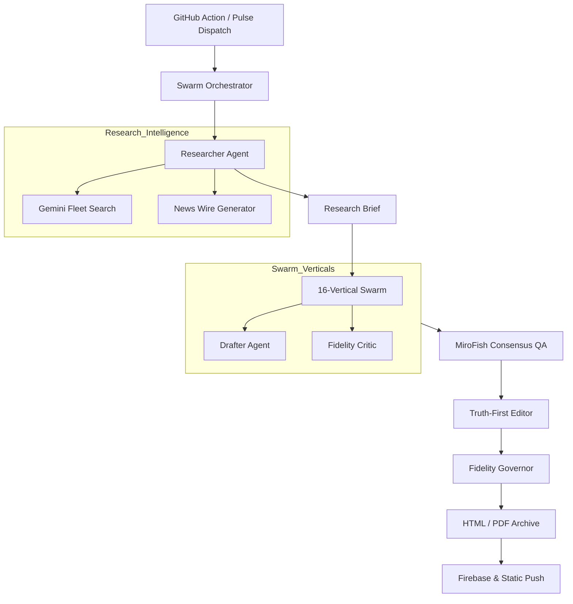

# BlogsPro Institutional Intelligence Pipeline

BlogsPro is an autonomous, sovereign-grade institutional intelligence pipeline. It leverages a hierarchical multi-agent swarm, Vertex AI Model Garden, and Continuous Learning to synthesize, audit, and distribute high-density strategic research across four frequencies (Hourly, Daily, Weekly, Monthly).

**Live site:** <https://blogspro.in>

---

## Architecture & Infrastructure

| Layer | Technology |
| --- | --- |
| **Hosting** | GitHub Pages (Static generated) |
| **Container Orchestration** | Google Kubernetes Engine (GKE) |
| **Database & Persistence** | Firebase Firestore |
| **Authentication** | Firebase Auth |
| **Edge Compute** | Cloudflare Workers & KV Cache |
| **Email Distribution** | Resend API (`newsletter@mail.blogspro.in`) |
| **Error Monitoring** | Sentry (Webhook to Telegram & GitHub) |
| **AI Orchestration Backbone** | Vertex AI & Google AI Studio (Native `@google/genai` integration) |
| **Sovereign AI Fleet** | LLaMA 405B, Gemini 1.5 Pro/Flash, Claude 3.5 Sonnet, DeepSeek V3, Cerebras, Groq |
| **Governance & Security** | Everything Claude Code (ECC) Antigravity Hooks |
| **CI/CD** | GitHub Actions |

---

## Institutional Persona & Mandate

The pipeline is strictly governed by the following core principles (defined in `SOUL.md`):

1. **Truth-First**: All content must be cynical, data-driven, and devoid of promotional language. No bullish fluff. No brand mentions.
2. **Sovereign AI**: The pipeline operates exclusively through cloud-native providers (Vertex AI / Model Garden). No local desktop fallbacks.
3. **Set and Forget**: Fully autonomous operations. Failures self-heal via an advanced `AI-Balancer` using fleet rotation, node blacklisting, and a mandatory 65-second exponential backoff recovery.
4. **Institutional Density**: Every generated word must carry analytical weight. No filler, no hedging.

---

## AI Pipeline — Swarm Architecture

The pipeline synthesizes research through a multi-tier agent structure governed by the `ResourceManager` and `AI-Balancer`.



**AI Tiers (Node Pool):**

| Tier | Role | Primary Nodes |
| --- | --- | --- |
| **Tier 1 (Anchor)** | Core synthesis, Management | LLaMA 405B (Vertex), SambaNova 405B, Claude 3.5 Sonnet |
| **Tier 2 (Audit)** | Verification, Repair | Cerebras (Llama 8B), Groq 70B, Gemma 2 9B |
| **Tier 3 (Generate)** | Raw drafting, Search | Gemini 1.5 Pro, Gemini 1.5 Flash (Native) |
| **Tier 4 (Utility)** | Proxies, Bridges | Cloudflare AI, HuggingFace, DeepSeek V3 |

**Core Pipeline Scripts:**
- `scripts/generate-institutional-tome.js` — The master generation cascade (handles `--freq=hourly|daily|weekly|monthly`).
- `scripts/lib/ai-service.js` — Autonomous node pool rotation, error blacklisting, and `@google/genai` dispatch.
- `scripts/lib/swarm-orchestrator.js` — Multi-agent orchestration and context consolidation.
- `scripts/lib/storage-bridge.js` — GKE Workload Identity REST wrapper for Firebase/Firestore persistence.

---

## Key Directories

```text
k8s/              Google Kubernetes Engine (GKE) deployment manifests
scripts/lib/      AI pipeline core (ai-service.js, swarm-orchestrator.js)
scripts/          Pipeline scripts and utilities
api/              Cloudflare Worker source files
js/               Frontend JavaScript modules
mirofish/         Python backend (FastAPI)
briefings/        Generated hourly/daily briefings
articles/         Generated weekly/monthly manuscripts
p/                Generated static SEO pages
workers/sentry/   Sentry webhook worker
.github/workflows GitHub Actions CI/CD pipelines
```

---

## Everything Claude Code (ECC) Integration

BlogsPro utilizes a custom, native implementation of **ECC (Everything Claude Code)**. Unlike standard setups, our governance logic is fully **Antigravity-native** and decoupled from the Claude Code CLI.

All hooks reside in `.claude/hooks-antigravity/` and are enforced via `pre-commit` and `pre-push`:
- `governance-gate.cjs` — Enforces secrets scanning (14 patterns) and architectural policy (blocks `localhost` in prod).
- `design-quality-check.cjs` — Ensures HTML/CSS does not drift into generic templates (blocks raw Bootstrap, Lorem Ipsum).
- `cost-tracker.cjs` — Proxies token usage by logging file frequencies and line counts.
- `continuous-learning.cjs` — Extracts patterns from AI tool usage to refine future swarm orchestration.
- `format-typecheck.cjs` — Batch formatting and type-checking barrier.

Run the full audit manually:
```bash
npm run ecc:full-audit
```

---

## Cloudflare Edge Workers

| Worker | Config | Purpose |
| --- | --- | --- |
| `blogspro-newsletter` | `wrangler.toml` | Dispatches briefs via Resend Batch API |
| `blogspro-seo-worker` | `wrangler-seo.toml` | Dynamic SEO injection for OpenGraph and Twitter cards |
| `blogspro-sentry-webhook` | `workers/sentry/wrangler.toml` | Catches Sentry events, triggers Telegram alerts, creates GitHub issues |
| `blogspro-upstox` | `api/upstox-worker.js` | Secure market data proxy |

---

## Local Setup & Development

### Prerequisites
- Node.js 18+
- Wrangler CLI (`npm i -g wrangler`)

### Installation

```bash
npm install
npm run ecc:install-hooks  # Installs the Antigravity Git hooks
```

### Environment Configuration

The pipeline utilizes `.env` in local development but relies on GitHub Secrets and GKE Workload Identity in production. Required variables:
```env
# AI APIs
GEMINI_API_KEY=
GROQ_API_KEY=
CEREBRAS_API_KEY=
SAMBANOVA_API_KEY=
CLOUDFLARE_API_TOKEN=
CF_ACCOUNT_ID=

# GCP & Firebase
GOOGLE_CLOUD_PROJECT=
FIREBASE_PROJECT_ID=
FIREBASE_SERVICE_ACCOUNT_KEY_PATH=/path/to/sa.json

# Utility
TELEGRAM_BOT_TOKEN=
TELEGRAM_CHAT_ID=
```

### Running the Swarm Locally

```bash
# Force an hourly brief generation (dry runs if API keys are missing)
node scripts/generate-institutional-tome.js --freq=hourly --force
```

## Fixed Bugs & Resolution History

To prevent regressions and track maintenance efforts, all fixed bugs are logged here:

### Infrastructure & Security
- **Mirofish API Path Traversal Bounds**: Enforced strict directory constraints across `kv.py`, `simulation.py`, and `simulation_manager.py` preventing relative pathway escapes.
- **Duplicate Operational Clones**: Cleared redundant backup variants (`__init__ 3.py`, `config 3.py`, etc.) from staging.

### Operations & Pipelines
- **Hourly Pulse 404 Accessibility**: Resolved routing generation mismatch discrepancies.
- **Swarm ReferenceError Suppression**: Patched `ReferenceError` instances for `sectorResults` and `telemetry` in `swarm-orchestrator.js` by enforcing rigorous variable initialization and null-safety.
- **Sentry Alert Noise Abatement**: De-escalated redundant "Blackboard" memos from high-priority Sentry alerts to low-overhead breadcrumbs.
- **AI Gateway Resilience**: Hardened Cloudflare AI Gateway handlers with exponential backoff retries to absorb transient model rate limits (HTTP 429).
- **CI/CD Smoke Test Failures**: Resolved persistent failures by hardening module loading tests (using `domcontentloaded` and polling instead of static timeouts) and eliminating residual Git conflict markers in `init.js` that caused fatal syntax errors in production deployments.
---

## License

MIT
