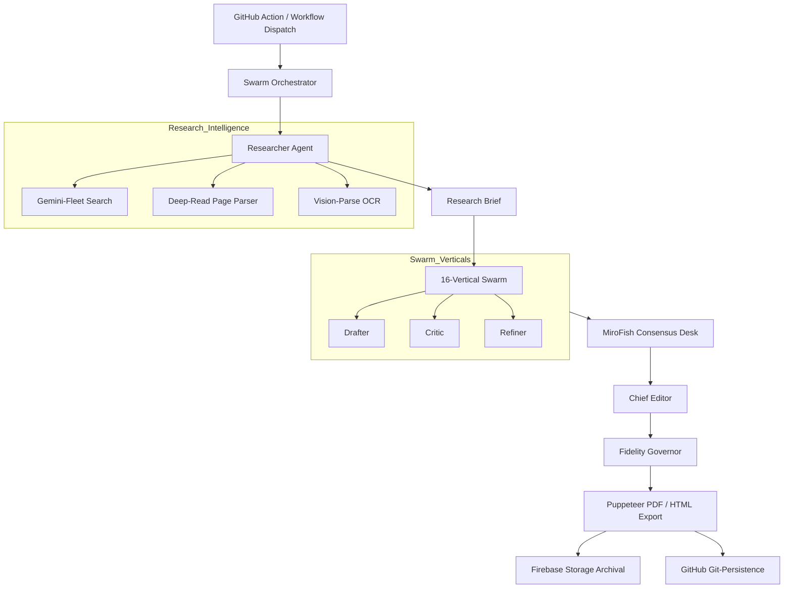
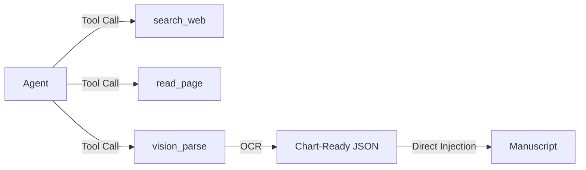

# BlogsPro Swarm 4.0 — Institutional Intelligence Terminal

A professional-grade, AI-powered autonomous research suite for high-fidelity institutional manuscript delivery. Built with a **Vanilla HTML/CSS/JS** distribution layer, **Firebase Storage** archival, and a logic-dense **Hierarchical Multi-Swarm Orchestrator**.

---

## 🏗️ Architecture & Logic Flows

### 1. Swarm Orchestration Pipeline (Hierarchical Consensus)
This flow illustrates the end-to-end generation of a 25,000-word institutional manuscript, from initial trigger to multi-layered archival.



### 2. Data Acquisition Loop (Self-Resolving OCR & Search)
How the agents autonomously resolve information gaps using internet search and vision tools.



---

## 🚀 Key Features

### Swarm 4.0 (Intelligence Layer)
- **16-Vertical Research Slate**: Specialized intelligence across Banking, Global Macro, Cards & Payments, Mutual Funds, and PE/VC flows.
- **MiroFish 10-Agent Consensus Desk**: Multi-agent strategic foresight and 'God View' scenario testing.
- **Gemini-Fleet Research Desk**: Real-time internet research integration with tool-calling for up-to-the-minute market alpha.
- **Auto-Resolve Chart Injection**: OCR-based extraction of data series from institutional PDF/Images directly into `<chart-data>` visualizations.
- **Fidelity Governor**: Industrial-grade validation and self-healing layer for 25k-word MS structural integrity.

### Distribution Layer (CMS)
- **Vanilla Admin Panel**: Full-featured blog platform (Firestore + Auth + Cloudflare).
- **High-Fidelity PDF Distribution**: Automated Puppeteer-based manuscript printing and Firebase archival.
- **GitHub Actions Compute Bridge**: 6-hour high-compute persistent environment for ultra-high-density synthesis.

---

## 🛠️ Tech Stack

| Layer | Technology | Status |
|---|---|---|
| **Core** | Vanilla HTML5 / CSS3 / ES Modules | Operational |
| **Intelligence** | Gemini 1.5 Pro/Flash + Groq Llama 3.3 | Hardened |
| **Search Engine** | Gemini-Fleet / Google Search Tool-Calling | Integrated |
| **Vision/OCR** | Gemini 1.5 Flash (Vision-to-Chart Bridge) | Integrated |
| **Database** | Firebase Firestore | Primary |
| **Archival** | **Firebase Storage** (S3-Compatible) | Migrated (100%) |
| **Compute** | GitHub Actions (High-Compute Bridge) | Operational |
| **PDF Engine** | Puppeteer (Headless Print-to-PDF) | Operational |

---

## 📂 Project Structure

```
blogspro/
├── index.html               ← Public blog feed (homepage)
├── scripts/                 ← **Institutional Hub (Node.js)**
│   ├── generate-institutional-tome.js  ← 25k-word MS synthesis engine
│   ├── generate-pdf-worker.js         ← Puppeteer PDF print worker
│   ├── swarm-orchestrator.js          ← 16-vertical swarm logic
│   └── lib/                           ← Swarm prompts, templates, and fidelity-gov
├── mirofish/                ← **MiroFish: Strategic Consensus Engine**
│   ├── backend/              ← Multi-agent social evolution logic (Python)
│   ├── frontend/             ← Swarm visualization dashboard (Vue)
│   └── README.md             ← Predictive engine documentation
├── .github/workflows/       ← **CI/CD Pipeline**
│   ├── institutional-research.yml     ← MS Generation Workflow
│   └── pdf-generator.yml              ← PDF Export Workflow
├── firestore.rules          ← Firestore security rules
└── README.md
```

---

## Table of Contents

1. [Features](#features)
2. [Tech Stack](#tech-stack)
3. [Project Structure](#project-structure)
4. [Setup Guide](#setup-guide)
   - [Firebase Setup](#1-firebase-setup)
   - [Cloudflare Worker](#2-cloudflare-worker)
   - [AI Fallback Keys](#3-ai-fallback-keys-groq--gemini)
   - [Image Generation](#4-image-generation-cloudinary--worker)
   - [Firestore Security Rules](#5-firestore-security-rules)
   - [Deploy to GitHub Pages](#6-deploy-to-github-pages)
5. [Admin Panel Usage](#admin-panel-usage)
6. [AI Tools Reference](#ai-tools-reference)
7. [Data Schema](#data-schema)
8. [Known Issues & Fixes](#known-issues--fixes)
9. [Latest Security Hotfix (2026-03-21)](#latest-security-hotfix-2026-03-21)
10. [Dual-Agent Workboard (Claude + Codex)](#dual-agent-workboard-claude--codex)
11. [Environment Variables](#environment-variables)

---

## Features

### Content Management
- Rich text editor with Bold, Italic, Underline, H2/H3, Lists, Blockquotes, Links
- Draft / Publish workflow with live preview
- Category system (Fintech / Compliance / Strategy — customisable)
- Auto-generated SEO slugs and meta descriptions
- Reading progress bar on post pages
- Twitter & LinkedIn share buttons
- Sitemap generator

### AI Writing
- **AI Article Generator** — full long-form articles from a single topic prompt
- Word targets: 1.5k / 2.5k / 5k / 10k / 50k / 100k words, or custom
- Tone selector: Professional, Conversational, Authoritative, Citations, SEO Optimised
- Inline AI tools: Regenerate, Expand, Shorten section
- **AI Write** and **AI Image** buttons inside the editor toolbar
- Auto-generated excerpts
- Inline Chart.js data visualisations generated by AI
- **BlogsPro Swarm 4.0 (Institutional Terminal)** — autonomous 25,000-word manuscript engine.
  - **16-Vertical Research Slate** — Specialized intelligence across Banking, Global Macro, Cards & Payments, Mutual Funds, and PE/VC flows.
  - **MiroFish 10-Agent Consensus Desk** — Multi-agent strategic foresight and 'God View' scenario testing.
  - **Gemini-Fleet Research Desk** — Real-time internet research integration with tool-calling for up-to-the-minute market alpha.
  - **High-Fidelity PDF Distribution** — Automated Puppeteer-based manuscript printing and R2 archival.
  - **GitHub Actions Compute Bridge** — 6-hour high-compute persistent environment for ultra-high-density synthesis.

### AI SEO & Strategy Tools
- **Headline AI** — generate high-CTR titles with type & score
- **Topic Clusters** — semantic cluster maps for a keyword
- **Content Calendar** — 30-day publishing plan
- **Traffic Audit** — analyse top posts, suggest improvements
- **Gap Analysis** — find missing content vs competitors
- **Backlink Opportunities** — suggest link-building targets
- **Newsletter Drip** — email sequence generator
- **Auto Blog** — bulk-generate and publish multiple posts autonomously

### Platform
- Firebase Auth — email/password protected admin
- Role-based Firestore rules (admin / reader)
- Newsletter subscriber collection with email validation
- Comments subcollection with server-timestamp enforcement
- Admin stats dashboard
- Responsive design (mobile + desktop)

---

## Tech Stack

| Layer | Technology |
|---|---|
| Frontend | Vanilla HTML5 / CSS3 / ES Modules |
| Database | Firebase Firestore |
| Auth | Firebase Authentication (Email/Password) |
| AI Primary | **Gemini 1.5 Pro / Flash (March 2026 Fleet)** |
| AI Fallback | Groq Llama 3.3 / Mistral Large |
| Search Engine | **Gemini-Fleet / Google Search Tool-Calling** |
| Archival | **Cloudflare R2 (S3-Compatible)** |
| Compute | **GitHub Actions (High-Compute Bridge)** |
| PDF Engine | **Puppeteer (Headless Print-to-PDF)** |
| Hosting | GitHub Pages (static) |

---

## Project Structure

```
blogspro/
├── index.html               ← Public blog feed (homepage)
├── ...                      ← Frontend (HTML/CSS/JS)
├── scripts/                 ← **Institutional Hub (Node.js)**
│   ├── generate-institutional-tome.js  ← 25k-word MS synthesis engine
│   ├── generate-pdf-worker.js         ← Puppeteer PDF print worker
│   ├── swarm-orchestrator.js          ← 16-vertical swarm logic
│   └── lib/                           ← Swarm prompts, templates, and fidelity-gov
├── mirofish/                ← **MiroFish: Swarm Intelligence Engine**
│   ├── backend/              ← Multi-agent social evolution logic (Python)
│   ├── frontend/             ← Swarm visualization dashboard (Vue)
│   └── README.md             ← Predictive engine documentation
├── firestore.rules          ← Firestore security rules
└── README.md
```

---

## Setup Guide

### 1. Firebase Setup

**Create a Firebase project:**
1. Go to [Firebase Console](https://console.firebase.google.com/)
2. Click **Add project** → name it (e.g. `blogspro-ai`)
3. Enable **Google Analytics** (optional)

**Enable Firestore:**
1. Firebase Console → **Firestore Database** → **Create database**
2. Start in **Production mode** (you will add rules in Step 5)
3. Choose a region close to your users

**Enable Authentication:**
1. Firebase Console → **Authentication** → **Get started**
2. Enable **Email/Password** provider

**Get your Firebase config:**
1. Project Settings → **Your apps** → click **Web** (`</>`)
2. Register the app, then copy the `firebaseConfig` object

**Add config to `js/config.js`:**
```js
const FIREBASE_CONFIG = {
  apiKey:            "AIza...",
  authDomain:        "your-project.firebaseapp.com",
  projectId:         "your-project-id",
  storageBucket:     "your-project.appspot.com",
  messagingSenderId: "123456789",
  appId:             "1:123...:web:abc..."
};
```

**Create your admin user:**
1. Firebase Console → **Authentication** → **Users** → **Add user**
2. Enter your email and a strong password

**Set admin role in Firestore:**
1. Firebase Console → **Firestore** → Create collection `users`
2. Add a document with ID = your Firebase Auth UID
3. Add field: `role` (string) = `"admin"`

> Your Auth UID is shown in Authentication → Users → click the user row.

---

### 2. Cloudflare Worker

The Cloudflare Worker is the **primary AI backend**. It routes prompts to Llama / Mistral models and handles tone, category, and token budgeting.

1. Sign up at [Cloudflare](https://workers.cloudflare.com/) (free tier works)
2. Create a new Worker and paste your worker script
3. Add your AI provider API keys as Worker **Environment Variables**
4. Copy the Worker URL (e.g. `https://your-worker.your-subdomain.workers.dev`)
5. Set it in `js/config.js`:
```js
export const WORKER_URL = "https://your-worker.your-subdomain.workers.dev";
```

#### Automated Worker Creation (Wrangler)

You can automate Worker creation + secret upload from this repo:

```bash
CLOUDFLARE_API_TOKEN=your_token \
CLOUDFLARE_ACCOUNT_ID=your_account_id \
GITHUB_PAT=your_github_pat \
node bootstrap-worker.js \
  --name github-push \
  --script ./worker.js \
  --secret-env GITHUB_PAT:GITHUB_TOKEN \
  --secret DEPLOY_TOKEN=change-me
```

Notes:
- `bootstrap-worker.js` deploys the Worker and sets secrets using `wrangler@4`.
- `--secret-env ENV:SECRET_NAME` maps a local env var to a Worker secret key.
- Use `--dry-run` first to validate inputs without deploying.

---

### 3. AI Fallback Keys (Groq + Gemini)

Fallbacks activate automatically if Cloudflare rate-limits or errors. Both are **free** with no credit card.

**Groq** (1,000 req/day free):
1. Sign up at [console.groq.com](https://console.groq.com/)
2. Create an API key → copy the `gsk_...` key
3. Set in `js/config.js`:
```js
export const GROQ_API_KEY = "gsk_...";
```

**Gemini** (1,000 req/day free):
1. Go to [aistudio.google.com](https://aistudio.google.com/)
2. Click **Get API key** → copy the `AIza...` key
3. Set in `js/config.js`:
```js
export const GEMINI_API_KEY = "AIza...";
```

**AI fallback chain:**
```
Cloudflare Worker  →  Groq (Llama 4 / Llama 3.3 multi-model pool)  →  Gemini 2.5 Flash
```
Each provider is tried in order. If one fails or rate-limits, the next is used automatically.

---

### 4. Image Generation (Cloudinary + Worker)

**Cloudinary** (free tier):
1. Sign up at [cloudinary.com](https://cloudinary.com/)
2. Dashboard → copy your **Cloud Name**
3. Settings → **Upload Presets** → create an **unsigned** preset named `blogspro`
4. Set in `js/config.js`:
```js
export const CLOUDINARY_CLOUD_NAME    = "your-cloud-name";
export const CLOUDINARY_UPLOAD_PRESET = "blogspro";
```

**Image Worker** (Cloudflare):
1. Create a second Cloudflare Worker for image generation
2. Copy its URL and set:
```js
export const IMAGE_WORKER_URL = "https://your-image-worker.workers.dev";
```
> If the image worker fails, the system falls back automatically to [Pollinations.ai](https://pollinations.ai/) (free, no key required).

---

### 5. Firestore Security Rules

In Firebase Console → **Firestore** → **Rules**, replace all content with:

```
rules_version = '2';
service cloud.firestore {
  match /databases/{database}/documents {

    function isAdmin() {
      return request.auth != null
        && get(/databases/$(database)/documents/users/$(request.auth.uid)).data.role == 'admin';
    }

    match /posts/{postId} {
      allow list: if (resource.data.published == true && resource.data.premium != true)
                  || request.auth != null;
      allow get:  if resource.data.premium != true || request.auth != null;
      allow write: if isAdmin();
    }

    match /posts/{postId}/comments/{commentId} {
      allow read: if true;
      allow create: if request.auth != null
                    && request.resource.data.text is string
                    && request.resource.data.text.size() > 2
                    && request.resource.data.text.size() < 1000
                    && request.resource.data.authorUid == request.auth.uid
                    && request.resource.data.createdAt == request.time;
      allow delete: if isAdmin();
      allow update: if false;
    }

    match /users/{userId} {
      allow read: if request.auth.uid == userId || isAdmin();
      allow create: if request.auth.uid == userId;
      allow update: if (request.auth.uid == userId
                    && !('role' in request.resource.data.diff(resource.data).affectedKeys()))
                    || isAdmin();
      allow delete: if request.auth.uid == userId || isAdmin();
    }

    match /subscribers/{subId} {
      allow create: if request.resource.data.email is string
                    && request.resource.data.email.matches('.*@.*\\..*')
                    && request.resource.data.email.size() > 5
                    && request.resource.data.email.size() < 255;
      allow read, update, delete: if isAdmin();
    }

  }
}
```

Click **Publish**.

---

### 6. Deploy to GitHub Pages

1. Push all files to a GitHub repository (public or private)
2. GitHub → **Settings** → **Pages**
3. Source: **Deploy from a branch** → `main` → `/ (root)`
4. Your blog will be live at `https://yourusername.github.io/your-repo/`

**Custom domain:**
1. Add your domain to the `CNAME` file (one line, e.g. `blog.yourdomain.com`)
2. Add a CNAME DNS record at your registrar pointing to `yourusername.github.io`
3. GitHub Pages → enable **Enforce HTTPS**

---

## Admin Panel Usage

| Page | URL | Purpose |
|---|---|---|
| Blog | `index.html` | Public post feed |
| Post | `post.html?id=POST_ID` | Single article reader |
| Login | `login.html` | Admin sign in |
| Admin | `admin.html` | Write, edit, manage posts |
| Dashboard | `dashboard.html` | Stats and analytics |
| Account | `account.html` | Profile settings |

### Writing a Post

1. Go to `login.html` → sign in with your admin credentials
2. Click **New Post** in the sidebar
3. Enter a topic in the AI prompt box (e.g. `brazil fintech space`)
4. Choose tone, word target, and click **Generate Article**
5. The editor fills in with AI-generated content — edit freely
6. Set the **Category**, review the auto-generated **Slug** and **Meta Description**
7. Click **Save Draft** to save without publishing, or **Publish** to go live

### Editing an Existing Post

1. Click **All Posts** in the sidebar
2. Click any post title to open it in the editor
3. Make changes → click **Publish** (or **Save Draft**)

### Deleting a Post

In All Posts view → click the delete icon next to a post.

---

## AI Tools Reference

All tools are in the **AI Tools** sidebar section of the admin panel.

| Tool | What It Does |
|---|---|
| **Headline AI** | Generates N high-CTR headlines for a topic with type and quality score |
| **Traffic Audit** | Analyses your top posts and suggests improvement actions |
| **Topic Clusters** | Builds a semantic content cluster map for a keyword |
| **Content Calendar** | Creates a 30-day publishing schedule with titles and dates |
| **Gap Analysis** | Identifies topics your competitors cover that you don't |
| **Backlink Opportunities** | Suggests sites and angles for link-building |
| **Newsletter Drip** | Writes a 5-email drip sequence for a topic |
| **Auto Blog** | Generates and publishes N posts at once from a seed topic |

### Inline Editor AI

| Button | Action |
|---|---|
| **AI Write** | Continues or rewrites the selected paragraph |
| **AI Image** | Generates a contextual image and inserts it |
| **Regenerate** | Rewrites the current section |
| **Expand** | Adds more detail to the selected section |
| **Shorten** | Condenses the selected section |
| **Conversational** | Rewrites in a casual, reader-friendly tone |
| **Authoritative** | Rewrites in an expert, data-driven tone |
| **Citations** | Adds inline references and a sources section |
| **SEO Optimize** | Improves keyword density and headings for search |

---

## Data Schema

### `posts` collection

```
{
  title:       string,
  excerpt:     string,
  content:     string (HTML),
  category:    "Fintech" | "Compliance" | "Strategy",
  slug:        string (URL-safe, auto-generated),
  published:   boolean,
  premium:     boolean,
  authorUid:   string (Firebase Auth UID),
  authorName:  string,
  authorEmail: string,
  metaDesc:    string (max 160 chars),
  createdAt:   timestamp,
  updatedAt:   timestamp
}
```

### `posts/{postId}/comments` subcollection

```
{
  text:        string (3–1000 chars),
  authorUid:   string (Firebase Auth UID),
  authorName:  string,
  createdAt:   timestamp (server-enforced)
}
```

### `users` collection

```
{
  email:       string,
  name:        string,
  photoURL:    string,
  bio:         string,
  role:        "admin" | "reader" | "editor" | "coauthor",
  requestedRole: string (optional),
  createdAt:   timestamp
}
```

### `subscribers` collection

```
{
  email:     string,
  createdAt: timestamp
}
```

---

## Latest Security Hotfix (2026-03-21)

### Files changed

- `firestore.rules`
- `register.html`
- `dashboard.html`
- `index.html`
- `account.html`
- `deploy-worker.js` (CLI helper to push files via the same Cloudflare Worker used by `deploy.html`)

### What was fixed

1. **Blocked role escalation in Firestore**  
   New users can no longer self-assign elevated access by writing `role: "admin"` into their own user document.

2. **Contributor post flow aligned with rules**  
   Rules now support admin-assigned contributors (`editor`, `coauthor`) creating/updating only their own posts, while protecting privileged fields.

3. **Registration hardened**  
   New accounts are always created as `reader`; any elevated role selection is stored as a `requestedRole` request for admin review.

4. **Public/client queries aligned to secure rules**  
   Public feed and user dashboard now query with filters (`published`, `authorUid`) instead of reading full collections and filtering client-side.

5. **Account deletion order made safer**  
   Account deletion now deletes Firebase Auth first, then attempts Firestore profile cleanup, avoiding half-deleted auth states.

6. **Admin detection standardized**  
   Home page admin/nav behavior now uses Firestore role checks instead of a hardcoded admin UID.

### Deployment status

- Firestore rules: published.
- GitHub deploy commit for hotfix files: `9d48ea3` ("Deploy 5 files from ZIP (path discovery mode)").
- GitHub deploy commit for deploy CLI tool: `db29511` ("Add CLI deploy script for Cloudflare worker push").

### Additional product fixes (2026-03-21)

1. **Post author metadata enforced on save**  
   New/updated posts now persist `authorUid`, `authorName`, and `authorEmail`.

2. **Author visible in public + admin views**  
   Author now renders in post cards (`index.html`), article header (`post.html`), and admin post tables.

3. **Admin Account section added in Admin panel**  
   New `People → Account` view in `admin.html` allows admin profile edits (`name`, `photoURL`, `bio`).

4. **Mobile editor write reliability fix**  
   Mobile editor layout was flattened, writing area made touch-friendly, and tap-to-focus hardening was added so post writing works on smaller screens.

### Regression prevention (must follow before every push)

1. **Author fields are mandatory on post save**  
   Never remove `authorUid`, `authorName`, `authorEmail` from `savePost()` payload in `js/posts.js`.

2. **Admin + public views must show author safely**  
   Keep fallback logic (`name -> email prefix -> BlogsPro`) in:
   - `index.html` (post cards)
   - `post.html` (article author bar)
   - `js/posts.js` (admin table render)

3. **Mobile editor must stay single-scroll on small screens**  
   In `css/admin.css` for `max-width:900px`, do not reintroduce nested scroll containers for:
   - `.v2-shell`
   - `.v2-editor-main`
   - `.v2-editor-scroll`
   - `#editor`

4. **Editor touch focus must remain enabled**  
   Keep mobile focus hardening in `js/editor.js`:
   - `touchstart -> editor.focus()`
   - click-to-focus fallback when image not selected

5. **Admin account panel must remain writable**  
   Keep `People -> Account` flow wired:
   - `admin.html` view `#view-account`
   - `js/admin-account.js` load/save
   - `js/nav.js` hook for `data-view="account"`

6. **Pre-release smoke test (mandatory)**
   - Desktop: create draft, publish, edit, republish.
   - Mobile: open `admin.html`, type in editor for 30+ seconds, save draft.
   - Public: verify author name on homepage card + post page.
   - Admin: verify `People -> Account` save persists after refresh.

---

## Dual-Agent Workboard (Claude + Codex)

This section is the source of truth for parallel bot work.  
Before either bot edits code, update this table first.

### Coordination rules

1. Claim ownership before editing files.
2. Do not edit files owned by the other bot unless owner is `UNCLAIMED`.
3. On completion, set status to `DONE` and leave a one-line handoff note.
4. If blocked, set status to `BLOCKED` with reason and expected next action.

### Workboard

| Area / Task | Owner | Status | Files | Last Update (IST) | Handoff Note |
|---|---|---|---|---|---|
| Security rules + auth hardening | Codex | DONE | `firestore.rules`, `register.html`, `index.html`, `dashboard.html`, `account.html` | 2026-03-21 | Hotfix shipped and live on GitHub. |
| Deploy automation tooling | Codex | DONE | `deploy-worker.js`, `deploy.html` | 2026-03-21 | CLI deploy helper added; uses same Worker as deploy UI. |
| Nexus Institutional Terminal | Antigravity | DONE | `scripts/*`, `dist/*` | **2026-03-31** | **HARDENED Swarm 4.0 Logic Shipped.** 16-Vertical research & PDF export operational. |
| Strategic Pulse Expansion | Codex | DONE | `pulse_final.log`, `data-fetchers.js` | 2026-03-31 | Real-time internet research integrated. |

### Quick handoff template

Use this format when updating the table:

`[BOT]=Claude|Codex  [STATUS]=TODO|IN_PROGRESS|BLOCKED|DONE  [FILES]=a,b,c  [NOTE]=one-line summary`

---

## Known Issues & Fixes

### Groq model not found error

**Error:** `The model 'meta-llama/llama-4-maverick-17b-128e-instruct' does not exist or you do not have access to it.`

**Cause:** Groq removed the `meta-llama/` namespace prefix from Llama 4 model IDs.

**Fix:** In `js/ai-core.js`, update the model IDs:

```js
// WRONG (old)
'meta-llama/llama-4-maverick-17b-128e-instruct'
'meta-llama/llama-4-scout-17b-16e-instruct'

// CORRECT (current)
'llama-4-maverick-17b-128e-instruct'
'llama-4-scout-17b-16e-instruct'
```

This affects both the `ARTICLE_MODEL_POOL` array and the `GROQ_MODELS` array in `ai-core.js`.

---

### Image generation timeout

**Cause:** The Cloudflare image worker has a 2-minute timeout. Very large resolution requests may exceed this.

**Fix:** The system automatically falls back to Pollinations.ai. To reduce timeouts, keep image dimensions at or below 1024×1024.

---

## Environment Variables

All keys are set directly in `js/config.js`. There is no `.env` file since this is a static site.

| Variable | Where to Get It | Required |
|---|---|---|
| `FIREBASE_CONFIG` | Firebase Console → Project Settings | ✅ Yes |
| `WORKER_URL` | Cloudflare Workers dashboard | ✅ Yes |
| `GROQ_API_KEY` | [console.groq.com](https://console.groq.com/) | ⚡ Recommended |
| `GEMINI_API_KEY` | [aistudio.google.com](https://aistudio.google.com/) | ⚡ Recommended |
| `IMAGE_WORKER_URL` | Cloudflare Workers dashboard | 🖼 For AI images |
| `CLOUDINARY_CLOUD_NAME` | Cloudinary dashboard | 🖼 For AI images |
| `CLOUDINARY_UPLOAD_PRESET` | Cloudinary → Upload Presets | 🖼 For AI images |

> ⚠️ **Security note:** Since `config.js` is public (client-side), these keys are visible to anyone who views source. Restrict your Firebase keys using [Firebase App Check](https://firebase.google.com/docs/app-check) and lock your Cloudinary upload preset to your domain only.

---

## License

MIT — free to use, modify, and deploy.
